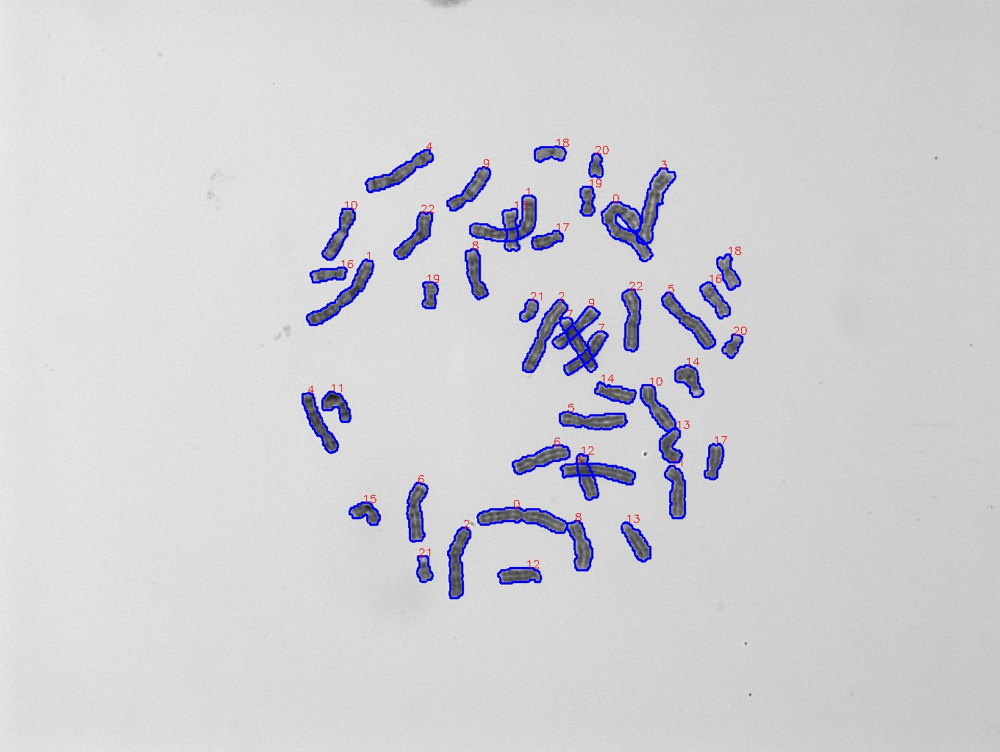

# 🧬 Chromosome Classification with Deep Learning

This project aims to classify human chromosomes from microscopy images using convolutional neural networks (CNNs), specifically ResNet-based architectures. It includes preprocessing, annotation, model training, prediction, and evaluation pipelines.

---

## 📁 Project Structure
```
.
├── data/
│   ├── raw/                   # Original chromosome images and annotation .txt files
│   └── processed/
│       ├── chromosomes/       # Extracted and labeled chromosome crops
│       ├── train/             # Training dataset (class-based folders)
│       └── test/              # Test dataset (class-based folders)
├── models/                    # Trained model checkpoints (.pth)
├── outputs/
│   ├── annotated_images/      # Images with predicted chromosome labels
│   ├── predicted_labels/      # Predicted labels (.txt) by model
│   └── true_labels/           # Ground-truth labels (.txt) for evaluation
├── src/
│   ├── annotation.py          # Draws polygon annotations and IDs on chromosome images
│   ├── chromosome_cut.py      # Extracts rotated and cropped individual chromosomes from annotated images
│   ├── classifier.py          # Model training
│   ├── confusion.py           # Confusion matrix analysis
│   ├── filecount.py           # Duplicate file name checker
│   ├── predict_and_annotate.py# Runs prediction and saves annotated images
│   ├── split_dataset.py       # Train/test split of cropped chromosomes
│   └── testpredicter.py       # Auxiliary script for testing prediction routines 
```
---

## 🧠 Model

- Uses pretrained ResNet18 and ResNet34 from torchvision.models
- Final layer replaced with a 24-class classifier (chromosomes 1–22, X, Y)

---

## 🚀 How to Run

1. Clone the repository
```
    git clone https://github.com/asebyrm/chromosome-classification.git
    cd chromosome-classification
```
2. Install dependencies
```
    pip install -r requirements.txt
```
3. Preprocess and split the dataset
```
    python src/chromosome_cut.py
    python src/split_dataset.py
```
4. Train the model
```
    python src/classifier.py
```
5. Evaluate model performance
```
    python src/confusion.py
```
6. Run prediction and annotate results
```
    python src/predict_and_annotate.py
```
---

## 📊 Sample Output

- Annotated predictions → outputs/annotations/
- Text predictions → outputs/predicted_labels/
- Ground truth        → outputs/true_labels/
- Evaluation plot     → Confusion matrix displayed during evaluation

---

## 🖼️ Example Annotated Image

Below is a sample annotated output generated by the model:


---

## 📦 Dependencies

Install with:
```
    pip install -r requirements.txt
```
Main libraries:
```
- torch
- torchvision
- opencv-python
- pillow
- matplotlib
- seaborn
- scikit-learn
- tqdm
```
---

## 👤 Author

Ahmet Selim Bayram  
Artificial Intelligence Engineering  
Istanbul Technical University

---

## ⚠️ Dataset Notice

The dataset used in this project was provided by my professor for research purposes.  
**Due to data ownership and privacy concerns, raw image data and processed outputs are not included in this repository.**  

Only model training code, annotation scripts, and evaluation logic are shared as open source.  
Please contact the project author if you are interested in collaborating on data-driven research.

